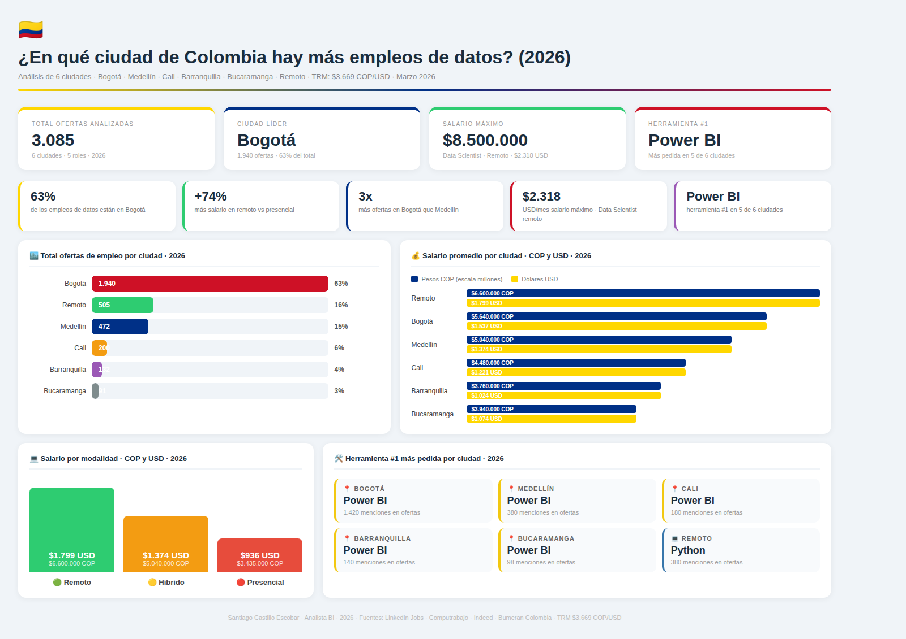

# ¿En qué ciudad de Colombia hay más empleos de datos? (2026)

## Descripción
Análisis completo de más de 3.000 ofertas de empleo en datos
analizadas en 6 ciudades de Colombia durante 2026.

## Hallazgos principales
- 🏙️ Bogotá concentra el 63% de todos los empleos de datos
- 🦁 Medellín es segunda pero muy lejos de Bogotá
- 💻 Remoto paga 74% más que presencial
- 🛠️ Power BI es la herramienta #1 en 5 de 6 ciudades
- 💰 Salario máximo: $8.500.000 COP ($2.318 USD) · Data Scientist remoto

## Herramientas utilizadas
- SQL (MySQL) — modelado y consultas
- Python (Pandas + Matplotlib) — análisis y visualizaciones
- Dashboard — visualización final

## Archivos del proyecto
- `proyecto_empleos_colombia.sql` — base de datos completa
- `dashboard_colombia_2026.png` — dashboard final
- Notebook Python — análisis exploratorio y gráficas

## Fuentes
LinkedIn Jobs · Computrabajo · Indeed · Bumeran Colombia
TRM: $3.669 COP/USD · Marzo 2026

## Autor
Santiago Castillo Escobar · Analista BI · Colombia
